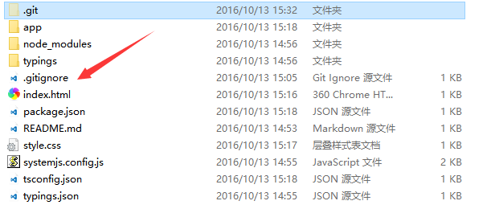

# 起因

```
在使用git对软件进行版本管理的时候我们总有一些不需要提交到版本库里的文件和文件夹，
或者在管理一个实际应用的开源项目的时候，不可以把带有数据库信息的文件上传到开源平台当中，
这个时候我们就需要让git自动忽略掉一下文件。
```

# 关于.gitignore

```
为了让git忽略指定的文件和文件夹，我们需要在项目的根目录当中创建.gitignore文件这个文件的名字还是挺好记的吧，
由git+ignore两个单词组成，创建的过程当中不要忘记前面的点。
```

```
注意：在windows当中创建这个.gitignore文件的时候可能会无法创建出来，因为windows的文件管理器强制要求有.后缀的文件应该有个文件名。
这点不用担心，直接在文本编辑器或者IDE里保存这个文件就可以创建文件了。
```


# 使用 .gitignore
使用.gitignore文件的方式很简单，只需要在文件里输入你想忽略的文件的规则就可以了，下面举个例子。

```
比如我的项目想忽略掉node_modules这个文件夹，直接输入：

node_modules/
就可以了，再次commit的时候就会忽略掉这个文件夹。
如果想忽略一个文件比如忽略oauth.json，再输入：

oauth.json
node_modules/
这样就可以了。
如果想忽略掉所有的后缀为json的文件，那么就输入：

*.json
oauth.json
node_modules/
那么这样所有的.json的文件就会被全部忽略，git就不会扫描和提交这些文件了。
```

# 总结
```
根据上面的实例我们总结，
在.gitignore文件当中，一行代表一条忽略规则，
如果是一个带“.”这种有后缀的字符串那么git就会忽略这个文件。
“*”表示的就是选中所有，
如果没有“.”就表示一个文件夹，上面的node_modules也可以不加“/”，
“/”的主要目的是为了表示路径，
比如你有可能想要忽略掉node_modules/app文件夹那么就会用到“/”。

另外https://github.com/github/gitignore github提供了一个通用的.gitignore库，如果懒得自己设置，可以直接在这个库里找找有没有你想要的忽略文件。
```


# 人个项目中的配置

 #### .gitignore文件配置如下:
```
# Eclipse
.classpath
.project
.settings/

# Intellij
.idea/
*.iml
*.iws

# Mac
.DS_Store

# Maven
target/

# log
/log/
/logs/
*.log

```


```
作者：ppmoon
链接：https://www.jianshu.com/p/ade52455c3a4
來源：简书
著作权归作者所有。商业转载请联系作者获得授权，非商业转载请注明出处。
```

